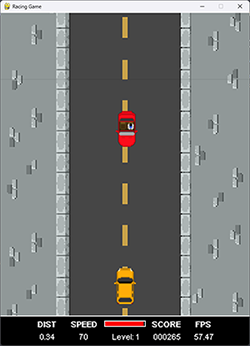

## GAMES MADE WITH PYGAME

<table>
<tbody>
<tr>
<td><strong>TITLE</strong></td>
<td><strong>SCREENSHOT</strong></td>
<td><strong>LINK</strong></td>
<td><strong>DESCRIPTION</strong></td></tr>
<tr>
<td><a href="https://github.com/paichiwo/pygame-games/tree/main/avoidacar">1.AVOIDACAR</a></td>
<td><figure class="image"></figure></td>
<td><a href="https://github.com/paichiwo/pygame-games/tree/main/avoidacar/output/">source_code</a></td>
<td>
<strong>First game I coded entirely myself :) &nbsp;</strong>  You start at 70km/h speed and be sure to avoid obstacles.&nbsp; Speed rises by 10km/h every 1km of distance driven.&nbsp; If you beat 10 levels - game crashes 😁

I've learnt a lot about:

pygame basics, collisions, physics, events, timers, oop, vectors, pixelart
</td>
</tr>

<tr><td>&nbsp;</td><td>&nbsp;</td><td>&nbsp;</td><td>&nbsp;</td></tr><tr><td>&nbsp;</td><td>&nbsp;</td><td>&nbsp;</td><td>&nbsp;</td></tr><tr><td>&nbsp;</td><td>&nbsp;</td><td>&nbsp;</td><td>&nbsp;</td></tr><tr><td>&nbsp;</td><td>&nbsp;</td><td>&nbsp;</td><td>&nbsp;</td></tr><tr><td>&nbsp;</td><td>&nbsp;</td><td>&nbsp;</td><td>&nbsp;</td></tr><tr><td>&nbsp;</td><td>&nbsp;</td><td>&nbsp;</td><td>&nbsp;</td></tr><tr><td>&nbsp;</td><td>&nbsp;</td><td>&nbsp;</td><td>&nbsp;</td></tr><tr><td>&nbsp;</td><td>&nbsp;</td><td>&nbsp;</td><td>&nbsp;</td></tr></tbody></table>