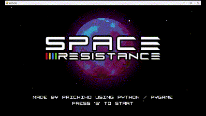
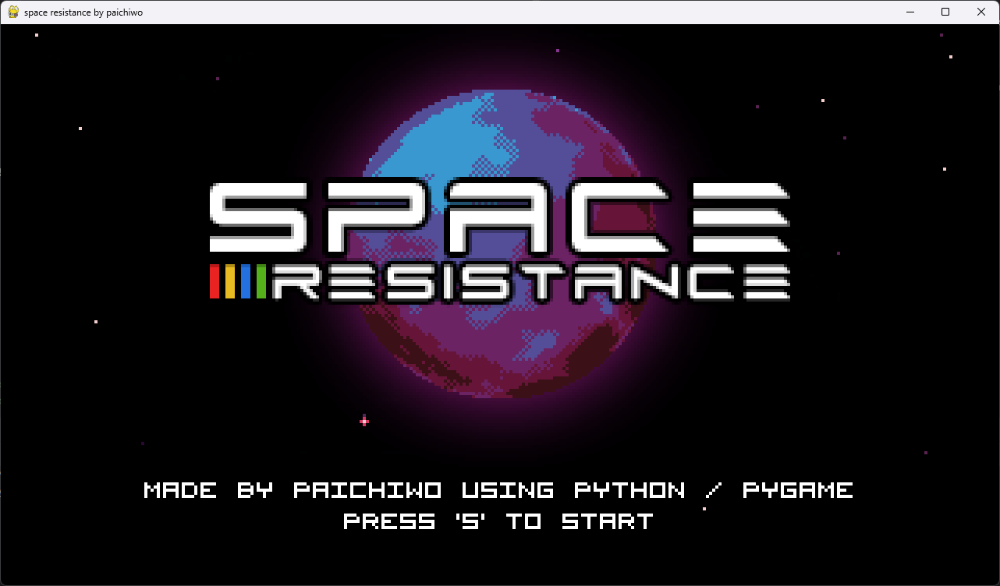
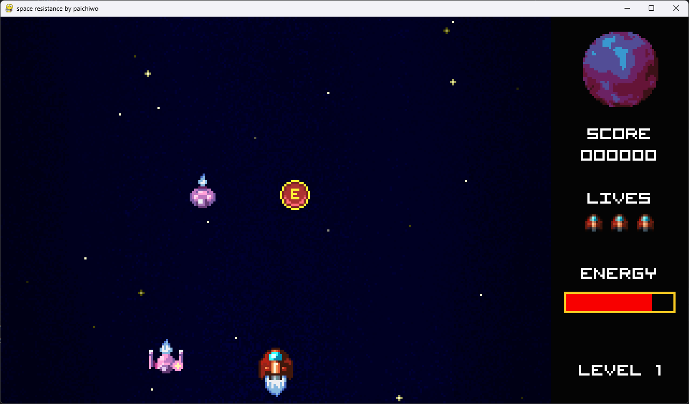
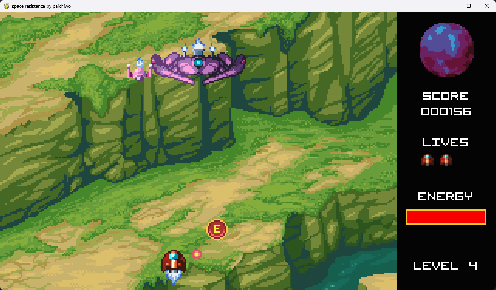

## SPACE RESISTANCE GAME

This is a game I developed with love and a PYGAME framework.

I've been born in the 80's, so my passion for computers and games comes from that era.
I still remember times when I used to spend all day (and my mom's pocket money)
in arcades playing everything I could. 

I wanted to develop a game that reminds me of those times, so SHOOT'EM UP genre was 
an obvious choice to learn pygame framework.  I even drew a lot of additional 
assets, experimented with PYGAME but most importantly, had a lot of fun while developing, 
and I hope you will have fun playing it.

## Screenshot

## Features

- Three main levels and a boss
- Music and sound effects

## Installation

1. Use the .exe file - (coming feature):   
    - link to come
2. Download source code:
    - install requirements: `pip install -r requirements.txt`
    - run `python main.py`

    
## Playing

1.  Run the game
2.  Controls: ARROW keys for movement, SPACE for shooting
3.  Score as much as you can
4.  Beat the boss
5.  Have fun

## Special Credit

I'd like to express appreciation for the outstanding work of Ansimuz (https://ansimuz.itch.io/)  
The game uses some assets from the package available at: https://ansimuz.itch.io/spaceship-shooter-environment

## License

This project is licensed under the [MIT License](./LICENSE).